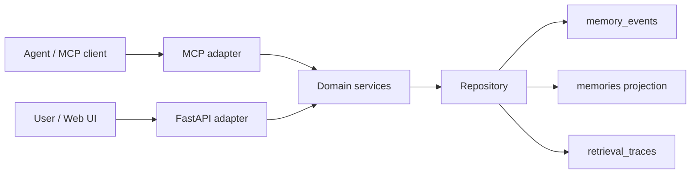
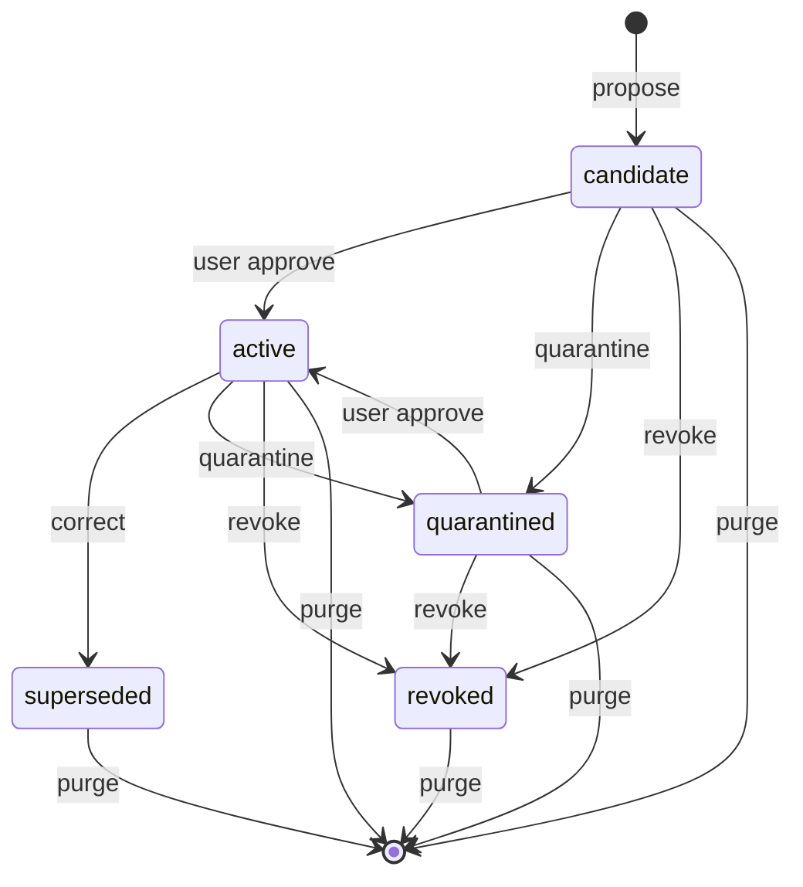

# 技术架构

> 文档状态：Active  
> 最近核对：2026-07-16

## 设计目标

Memory Workbench 是本地优先的 Agent Memory Control Plane。它不把记忆视为可以静默覆盖的一段文本，而是带有来源、scope、状态、版本和读取记录的受控对象。

当前有两个可独立启动的 Python adapter：FastAPI 提供管理接口和 Web UI，stdio MCP Server 提供 Agent 工具。它们复用同一领域层，并通过相同工作目录或 `MW_DB_PATH` 共享 SQLite 数据库。

## 运行结构



## 模块职责

| 路径 | 职责 |
|---|---|
| `domain/models.py` | 枚举、scope、记忆、事件、调用方上下文和 Trace 模型 |
| `domain/service.py` | 生命周期、敏感内容检查、可见性校验、检索与解释 |
| `storage/tables.py` | SQLAlchemy 表定义与索引 |
| `storage/repository.py` | 事件、投影、Trace 持久化及投影重建 |
| `api/routes.py` | HTTP 请求模型、管理接口和事务边界 |
| `mcp/server.py` | 六个 MCP 工具与 MCP 错误适配 |
| `static/index.html` | 当前最小管理 UI |
| `main.py` | Schema 初始化、FastAPI 应用和 loopback 服务入口 |

## 领域模型

### MemoryRecord

`MemoryRecord` 是可查询投影，不是最终事实来源。核心字段包括内容、kind、结构化 subject/predicate/value、scope、state、置信度、敏感级别、有效期、来源和 supersedes 关系。

### MemoryEvent

每次状态变化追加事件。事件通过 `previous_event_id` 形成每条记忆的历史链；同一事务内时间戳相同时，Repository 使用确定性的事件类型顺序保证重放一致。

hard purge 是唯一允许破坏性修改事件 payload 内容字段的操作；事件 ID、类型、actor、时间和关联保持不变，并保留无内容 tombstone。

### Scope

scope 从宽到窄：

```text
global -> workspace -> project -> agent -> session
```

调用方可以读取比自己更宽或相同层级的记录，但记录中声明的每个 ID 都必须与调用方一致。scope 过滤发生在文本匹配和排序之前。

### 生命周期



纠错不会原地覆盖：旧记录变为 `superseded`，新记录以新 ID 和 `supersedes_id` 创建为 active。

## 写入流程

1. HTTP/MCP adapter 解析输入和 caller scope。
2. 领域层拒绝命中凭据模式的内容。
3. 追加 `memory.proposed` 事件并写 candidate 投影。
4. 用户通过本地管理接口显式批准；Agent MCP 工具不能批准或 purge。
5. 调用方提交事务。

## 检索流程

1. Repository 在 SQL 查询中先限制状态和有效期。
2. 领域层对每条候选执行 scope 可见性过滤。
3. 当前版本在 subject、predicate、value、content 上做大小写无关子串匹配。
4. 按 confidence、更新时间和 ID 稳定排序并应用数量上限。
5. 写入 RetrievalTrace；原始 query 不落盘，只保存 hash/长度摘要。

当前没有 FTS5 或向量检索。引入它们时仍必须保持 scope-before-rank。

## 数据库与事务

- 默认数据库：当前工作目录下的 `memory_workbench.db`。
- 可通过 `MW_DB_PATH` 指定其他路径；测试使用 `:memory:`。
- HTTP 与 MCP adapter 持有事务边界；领域方法不提交。
- 事件追加和投影更新在同一事务中完成。
- 当前通过 `Base.metadata.create_all()` 初始化；迁移系统尚待引入。

## 安全边界

- Uvicorn 默认绑定 `127.0.0.1:8000`。
- Agent MCP 不暴露 approve、quarantine 或 purge。
- HTTP 生命周期接口被视为本地用户管理面，目前没有独立身份认证。
- secret 检测是启发式防线，不应替代系统凭据管理。
- Trace 默认不保存原始 query。
- Web UI 避免将记忆内容拼入内联 JavaScript handler。

如果未来允许远程绑定或允许 Agent 发起任意 localhost HTTP，请先增加真正的管理身份认证和明显的风险提示。
